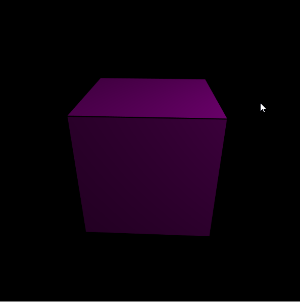

   
3D Animation
============
In addition to the 2 dimensional graphics functions you've used, P5 also has a set of 3 dimensional graphics functions. In this assignment you will create an animation using
one or more of these functions. The people who wrote P5 have put together a great [3D tutorial](https://github.com/processing/p5.js/wiki/Getting-started-with-WebGL-in-p5#introducing-webgl-in-p5js). You may also find slides 244 - 282 in the [slide presentation](https://docs.google.com/presentation/d/1fm_Di0qR4HpRWTf8tJtcW3u5by3OrilfXIPZ517K1js/edit?usp=sharing) helpful.

Suggested steps for starting this assignment:
-----------------------------------------------
1. Start a new [P5 program](https://editor.p5js.org/)
2. In `function setup()` you will need to call the 3 argument version of `createCanvas()`, e.g.`createCanvas(400, 400, WEBGL);` since we will be using the 3d functions.
3. In `function draw()` you could use the following functions in this order:
   * `background()`
   * `translate()` moves the coordinates where the box will be drawn
   * `rotateX()` rotates the box around the X axis
   * `rotateY()` rotates the box around the Y axis
   * `box()` draws the rotated and translated box
4. Experiment with different arguments to get a feel for how they effect the box.
5. You'll need someway to animate the cube. It could rotate on its own, or you could add something like `mouseDragged()` or `keyPressed()` with `mouseX` and `mouseY` used to change the amount of rotation. Whatever method you choose, since the amount of rotation will be changing, you'll will probably need a variable or two to store the amount of rotation in the x and y directions.

Optional Extensions
---------------------
* You may want to use `pointLight()` to make a 3 dimensional lighting effect. Moving the position of the `pointlight()` can create interesting effects.
* You can change the perspective with `camera()`
* Bind rotation to mouse or keys.
* Create a 3D shape that is not built in (not a torus, cube, sphere/ellipsoid, cone, plane, cylinder.) For example, you could create a composite 3D shape like a house (pyramid on a cube) or an ice cream cone (sphere on a cone)
These are only suggestions, your 3d animation doesn't have to look like any other. Have fun and be creative!

Samples of Student Work
-----------------------
[Emely](https://editor.p5js.org/emsarcenobravo/present/A7xSIt1qe)   
[Cyrus](https://editor.p5js.org/cygriffin/present/Ov5l_bhvT)   
[Marissa](https://editor.p5js.org/maholmes/present/OYBUOMrK_)   
[Daniil](https://editor.p5js.org/dakardava/present/nsAdyCn2L)   
[Rachel](https://editor.p5js.org/raroyer/present/yNRUchcJ9)   
[Benjamin](https://editor.p5js.org/bewong4/present/laLmDsssq)   

